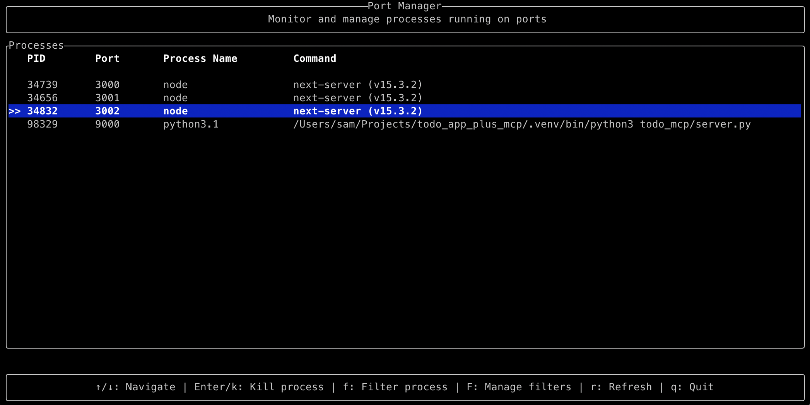

# Port Manager

> **✋ Note this is a Vibe Code Experiment.  Code and Docs where 100% generated using Windsurf with Claude 3.7 (thinking).  See [promts.md](./docs/promts.md)**

A TUI (Text User Interface) tool to track and manage processes running on local ports. This CLI utility helps you monitor which applications are using which ports and allows you to easily kill processes when needed. It includes configuration options to filter processes by port range and name.



## Features

- Display all processes running on ports
- Show process details (PID, port, process name, command)
- Filter processes by configurable port range (defaults to non-privileged ports 1024-49151)
- Filter out specific process names from the display (e.g., "Browser", "ControlCE")
- Add currently selected process to filter list with a single keystroke
- Manage filter list through a dedicated UI view
- Keyboard navigation to select processes
- Kill selected processes with a single keystroke
- Auto-refresh process list
- Modern terminal UI using Ratatui
- Persistent configuration with automatic saving

## Usage

```bash
# Run the port manager
cargo run

# Show processes running on a specific port
cargo run -- --port 8080
```

### Keyboard Controls

#### Process List View
- ↑/↓ arrows: Navigate between processes
- Enter or k: Kill the selected process
- f: Add current process to filter list
- F: Switch to filter management view
- r: Refresh the process list
- q: Quit the application

#### Filter Management View
- ↑/↓ arrows: Navigate between filters
- Enter or Delete: Remove the selected filter
- a: Add a new process filter
- F: Return to process list view
- q: Quit the application

## Requirements

- Rust and Cargo installed
- macOS (uses `lsof` command to detect processes on ports)

## Building from Source

```bash
# Clone the repository
git clone <repository-url>
cd port-manager

# Build the project
cargo build --release

# Run the executable
./target/release/port-manager
```

## Installation

To make the port manager available system-wide, you can install it in your PATH. Here are a few options:

### Option 1: Using Cargo Install (Recommended)

If you have Rust and Cargo installed, the simplest way is to use cargo's built-in installation feature:

```bash
# Navigate to the project directory
cd path/to/port-manager

# Install the binary locally
cargo install --path .
```

This will install the binary to `~/.cargo/bin/`, which should be in your PATH if you installed Rust with rustup.

### Option 2: Manual Installation

```bash
# Build the release version
cargo build --release

# Copy the binary to a location in your PATH
sudo cp target/release/port-manager /usr/local/bin/

# Make sure it's executable
sudo chmod +x /usr/local/bin/port-manager
```

### Option 3: Create a symbolic link

```bash
# Build the release version
cargo build --release

# Create a symbolic link in a directory that's in your PATH
sudo ln -s "$(pwd)/target/release/port-manager" /usr/local/bin/port-manager
```

### Verify Installation

After installation, you should be able to run the port manager from anywhere by typing:

```bash
port-manager
```

## Dependencies

- ratatui: Terminal UI library
- crossterm: Terminal manipulation
- sysinfo: System information retrieval
- anyhow: Error handling
- clap: Command line argument parsing
- tokio: Async runtime
- tracing: Logging
